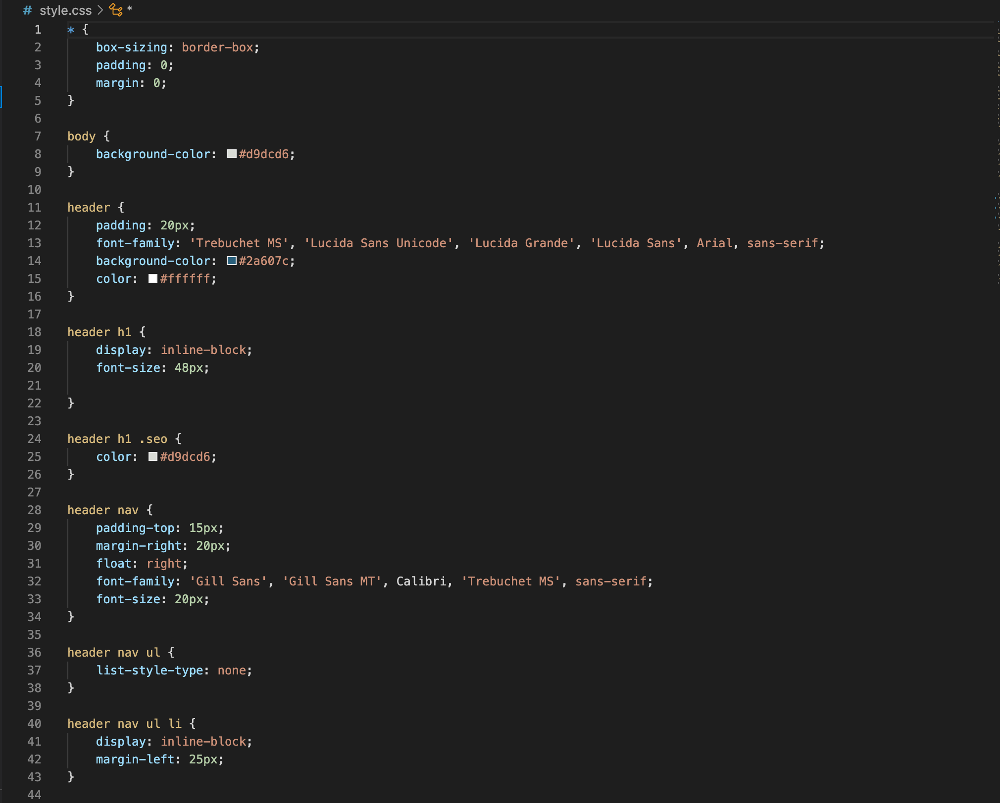

# UWA Week 01 Homework

> **The first homework assignment for UWA coding bootcamp was to refactor the html and css code for the Horiseon website. This was achieved by condensing the style.css document as well as formatting the html doc with proper html syntax, adding alt tags to images and confirming that the webpage elements still function in a correct and accessible way.**

> *Updated html doc*

> *Updated css doc*

> **The final result can be found at the following URL: https://lev8947.github.io/Horiseon2.0/**

